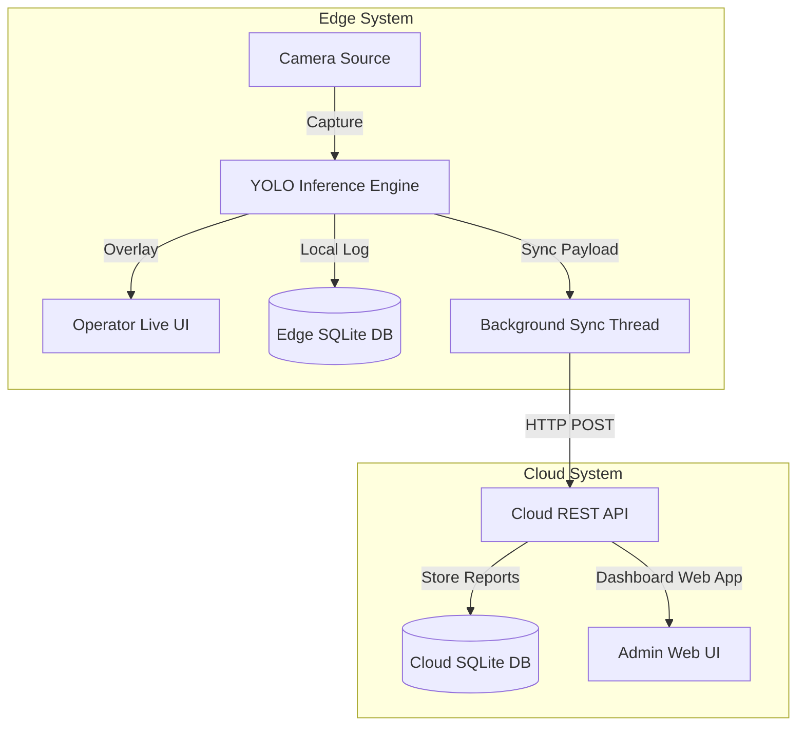

# Garment Inspection and Tracking System

A real-time defect detection and tracking system utilizing custom YOLO model inference at the edge (Raspberry Pi/local server) and centralized reporting and verification in the cloud.

## System Architecture



- **Edge Server (`edge/`)**: Lightweight FastAPI application running on local nodes (e.g. Raspberry Pi) to capture camera frames, perform local YOLO26 / YOLOE-26 inference, serve a live overlay interface to operators, and log scans locally.
- **Cloud Server (`cloud/`)**: Central management node that accepts synced garment scanning reports and provides an administrative dashboard to monitor defect distributions across all edge devices.
- **Shared Module (`shared/`)**: Data schemas and models shared between the cloud and edge microservices.

---

## Installation & Setup

Ensure you have **Python 3.11** installed.

### Quick Start (Collaborator Plug-and-Play)
Since the custom-trained model weights are pre-packaged in `runs/detect/garment_inspector_v2/weights/best.pt` and checked into the repository, you can start testing immediately without downloading datasets or running training:

1. **Clone & Setup Environment**:
   ```powershell
   git clone https://github.com/Skithrills/laundry_vision.git
   cd laundry_vision
   python -m venv .venv
   .venv\Scripts\activate
   ```
2. **Install Dependencies**:
   ```powershell
   pip install -r requirements.txt
   ```
3. **Run the Servers**:
   Refer to the [Running the Servers](#running-the-servers) section below to boot the Cloud Dashboard and Edge Operator UI. The databases and model weights will self-initialize out-of-the-box.

---

### Custom Training & Dataset Setup (Optional)
If you wish to modify the dataset or retrain the custom model:

1. **Install PyTorch with CUDA Acceleration** (for training on GPU, e.g., NVIDIA RTX 4060):
   ```powershell
   pip install torch torchvision --index-url https://download.pytorch.org/whl/cu121
   ```
2. **Download Datasets** (downloads and balances the Roboflow clothing datasets):
   ```powershell
   python scripts/training/download_roboflow.py
   ```
3. **Train the Model**:
   ```powershell
   python scripts/training/merge_and_train.py
   ```

---

## Running the Servers

### Start the Cloud Server
Starts the central dashboard at [http://localhost:8080](http://localhost:8080).
```powershell
.venv\Scripts\python -m uvicorn cloud.main:app --port 8080
```

### Start the Edge Server
Starts the edge node capturing frames at [http://localhost:8000/static/index.html](http://localhost:8000/static/index.html).
```powershell
# Windows PowerShell
$env:DEVICE_ID="Van-01"
$env:CLOUD_URL="http://localhost:8080"
$env:CAMERA_SOURCE="assets/test_clothing.png" # Or a camera index e.g., "0"
.venv\Scripts\python -m uvicorn edge.main:app --port 8000
```

---

## Verification

To verify the integration between Edge and Cloud servers automatically, run the integration suite:
```powershell
python scripts/tools/verify_system.py
```
This script launches mock instances of both servers, triggers a garment scan at the edge, verifies background database synchronization, and reports the status.
