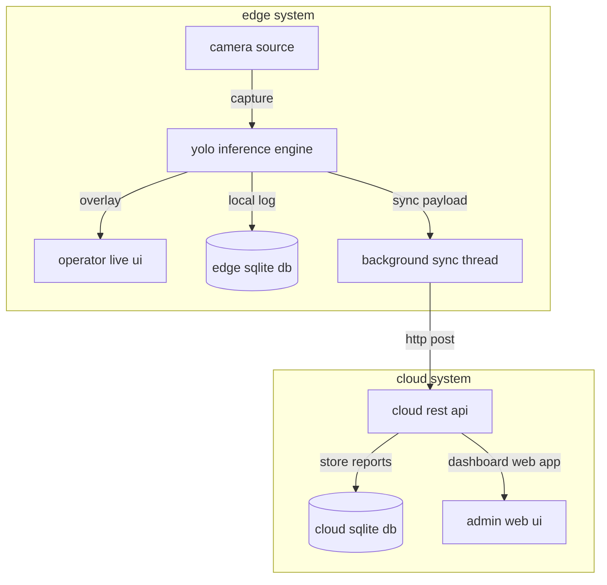

# love of laundry

[](https://www.python.org/)
[](https://docs.ultralytics.com/)
[](https://fastapi.tiangolo.com/)
[](https://opencv.org/)
[](https://www.sqlite.org/)

**love of laundry** is a real-time edge-to-cloud ai garment inspection and defect tracking system. it deploys custom-trained yolo object detection models on local edge nodes (raspberry pi / local inspection stations) with a live fastapi operator overlay, offline-first sqlite caching, and automated background synchronization to a central cloud analytics dashboard.

---

## system architecture



- **edge server (`edge/`)**: lightweight fastapi service running on local edge nodes (e.g., raspberry pi) to capture camera frames, perform local yolo inference (`runs/detect/garment_inspector_v2/weights/best.pt`), stream an annotated live overlay to station operators, and cache inspection logs locally.
- **cloud server (`cloud/`)**: central management service that ingests synced garment inspection reports and serves an administrative web dashboard to monitor defect distributions across all active edge stations.
- **shared module (`shared/`)**: unified data schemas and validation models shared between the edge and cloud microservices.

---

## key features

- **real-time edge defect detection**: custom-trained yolo weights detect stains, tears, and garment defects directly at the inspection station with low latency.
- **offline-first sqlite resilience**: edge stations log every scan locally to sqlite and automatically synchronize pending reports in the background when cloud connectivity is available.
- **live operator hud**: browser-based operator view with real-time bounding box overlays and confidence telemetry.
- **centralized cloud analytics**: multi-node aggregation dashboard tracking inspection throughput and defect categories across stations.

---

## installation & setup

ensure you have **python 3.11+** installed.

### quick start
custom-trained model weights are included in `runs/detect/garment_inspector_v2/weights/best.pt`, allowing you to run inference immediately out of the box:

1. **clone & set up virtual environment**:
   ```powershell
   git clone https://github.com/nnickahh/love-of-laundry.git
   cd love-of-laundry
   python -m venv .venv
   .venv\Scripts\activate
   ```
2. **install dependencies**:
   ```powershell
   pip install -r requirements.txt
   ```
3. **launch the servers**:
   follow the [running the servers](#running-the-servers) instructions below to start the cloud dashboard and edge operator ui. databases and model weights initialize automatically on first launch.

---

### custom training & dataset setup (optional)
to customize the dataset or retrain the garment inspection model:

1. **install pytorch with cuda acceleration** (for gpu training):
   ```powershell
   pip install torch torchvision --index-url https://download.pytorch.org/whl/cu121
   ```
2. **download & balance datasets**:
   ```powershell
   python scripts/training/download_roboflow.py
   ```
3. **train the model**:
   ```powershell
   python scripts/training/merge_and_train.py
   ```

---

## running the servers

### 1. start the cloud server
launches the central analytics dashboard at `http://localhost:8080`:
```powershell
.venv\Scripts\python -m uvicorn cloud.main:app --port 8080
```

### 2. start the edge server
launches the edge inspection node and operator ui at `http://localhost:8000/static/index.html`:
```powershell
$env:DEVICE_ID="Van-01"
$env:CLOUD_URL="http://localhost:8080"
$env:CAMERA_SOURCE="assets/test_clothing.png" # or a camera index e.g., "0"
.venv\Scripts\python -m uvicorn edge.main:app --port 8000
```

---

## verification

run the automated end-to-end integration suite to verify edge-to-cloud synchronization:
```powershell
python scripts/tools/verify_system.py
```
this script boots test instances of both servers, triggers an edge garment scan, verifies background sqlite database synchronization, and reports system health.

---

## author

**nick fong** ([@nnickahh](https://github.com/nnickahh))
