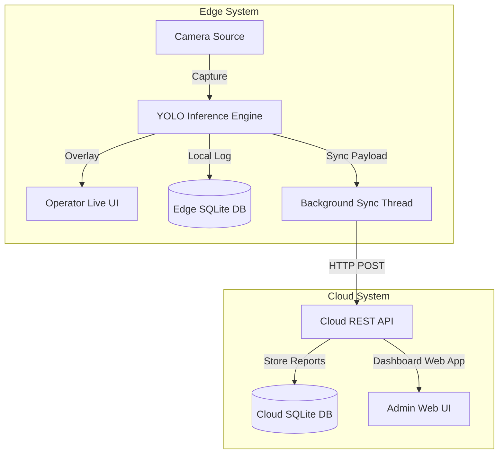

# Love of Laundry

[](https://www.python.org/)
[](https://docs.ultralytics.com/)
[](https://fastapi.tiangolo.com/)
[](https://opencv.org/)
[](https://www.sqlite.org/)

**Love of Laundry** is a real-time Edge-to-Cloud AI garment inspection and defect tracking system. It deploys custom-trained YOLO object detection models on local edge nodes (Raspberry Pi / local inspection stations) with a live FastAPI operator overlay, offline-first SQLite caching, and automated background synchronization to a central cloud analytics dashboard.

---

## System Architecture



- **Edge Server (`edge/`)**: Lightweight FastAPI service running on local edge nodes (e.g., Raspberry Pi) to capture camera frames, perform local YOLO inference (`runs/detect/garment_inspector_v2/weights/best.pt`), stream an annotated live overlay to station operators, and cache inspection logs locally.
- **Cloud Server (`cloud/`)**: Central management service that ingests synced garment inspection reports and serves an administrative web dashboard to monitor defect distributions across all active edge stations.
- **Shared Module (`shared/`)**: Unified data schemas and validation models shared between the edge and cloud microservices.

---

## Key Features

- **Real-Time Edge Defect Detection**: Custom-trained YOLO weights detect stains, tears, and garment defects directly at the inspection station with low latency.
- **Offline-First SQLite Resilience**: Edge stations log every scan locally to SQLite and automatically synchronize pending reports in the background when cloud connectivity is available.
- **Live Operator HUD**: Browser-based operator view with real-time bounding box overlays and confidence telemetry.
- **Centralized Cloud Analytics**: Multi-node aggregation dashboard tracking inspection throughput and defect categories across stations.

---

## Installation & Setup

Ensure you have **Python 3.11+** installed.

### Quick Start
Custom-trained model weights are included in `runs/detect/garment_inspector_v2/weights/best.pt`, allowing you to run inference immediately out of the box:

1. **Clone & Set Up Virtual Environment**:
   ```powershell
   git clone https://github.com/nnickahh/love-of-laundry.git
   cd love-of-laundry
   python -m venv .venv
   .venv\Scripts\activate
   ```
2. **Install Dependencies**:
   ```powershell
   pip install -r requirements.txt
   ```
3. **Launch the Servers**:
   Follow the [Running the Servers](#running-the-servers) instructions below to start the Cloud Dashboard and Edge Operator UI. Databases and model weights initialize automatically on first launch.

---

### Custom Training & Dataset Setup (Optional)
To customize the dataset or retrain the garment inspection model:

1. **Install PyTorch with CUDA Acceleration** (for GPU training):
   ```powershell
   pip install torch torchvision --index-url https://download.pytorch.org/whl/cu121
   ```
2. **Download & Balance Datasets**:
   ```powershell
   python scripts/training/download_roboflow.py
   ```
3. **Train the Model**:
   ```powershell
   python scripts/training/merge_and_train.py
   ```

---

## Running the Servers

### 1. Start the Cloud Server
Launches the central analytics dashboard at `http://localhost:8080`:
```powershell
.venv\Scripts\python -m uvicorn cloud.main:app --port 8080
```

### 2. Start the Edge Server
Launches the edge inspection node and operator UI at `http://localhost:8000/static/index.html`:
```powershell
$env:DEVICE_ID="Van-01"
$env:CLOUD_URL="http://localhost:8080"
$env:CAMERA_SOURCE="assets/test_clothing.png" # Or a camera index e.g., "0"
.venv\Scripts\python -m uvicorn edge.main:app --port 8000
```

---

## Verification

Run the automated end-to-end integration suite to verify Edge-to-Cloud synchronization:
```powershell
python scripts/tools/verify_system.py
```
This script boots test instances of both servers, triggers an edge garment scan, verifies background SQLite database synchronization, and reports system health.

---

## Author

**Nick Fong** ([@nnickahh](https://github.com/nnickahh))

